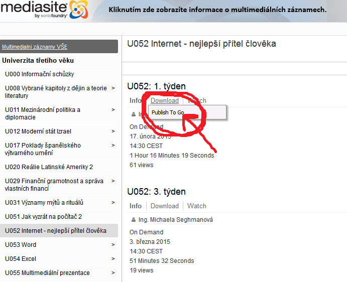
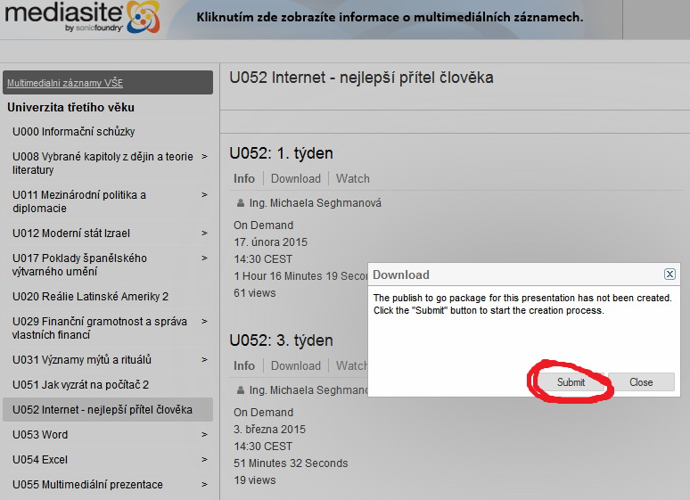

# v

**Convert a P2G (publish-to-go) package to a video slides podcast.**

*Mediasite Video Platform*

New files (mp4 + mp3) will show up right in the current directory.

## Where do you get P2G?

* <https://mediasite.vse.cz/Mediasite/Catalog/help/catalog.html#!Documents/downloadportablepresentations.htm>
* <http://edtech.ut.edu/media-site/127-downloading-a-mediasite-presentation>
* <https://mediasite.online.ncsu.edu/online/Play/b6f97300e83b4b8dbcd312d33b9cd7f41d>

## RELEASE NOTES

* <https://ffmpeg.zeranoe.com/builds/>
* <http://ffmpeg.org/ffmpeg-formats.html#concat>
* <http://www.indigostar.com/perl2exe.php>

## LICENSE

Released into the public domain.

## DISCLAIMER

Don't blame me.
